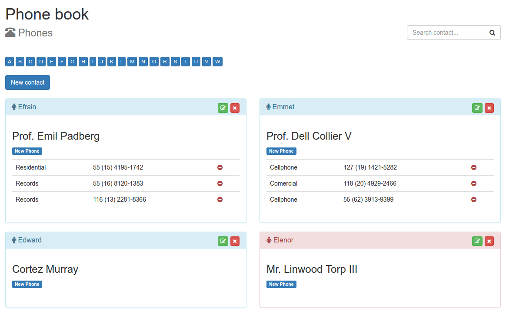

## Lumen Phone Book

Simple Lumen Appointment Book - PHP

## Install

**1.** Clone repository and install dependencies

`git clone https://github.com/deoliveiralucas/lumen-phone-book.git`

`composer install`

`bower install`

`gulp`

**2.** Configure **.env** file

`cp .env.example .env`

**3.** Execute migrations

`php artisan migrate --seed`

**4.** Run server

`php -S localhost:8000 -t public`

## Screenshot

